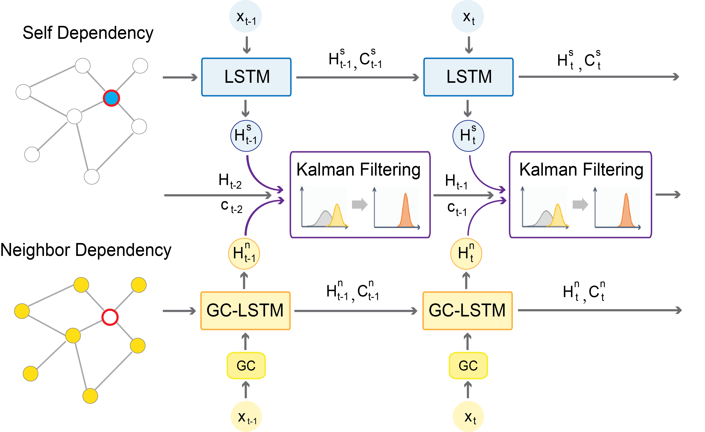

# Graph Convolutional Networks with Kalman Filtering for Traffic Prediction



This is a PyTorch implementation of Deep Kalman Filtering Network(DKFN) in the following poster paper: \
Fanglan Chen, Zhiqian Chen, Subhodip Biswas, Shuo Lei, Naren Ramakrishnan, and Chang-Tien Lu, [Graph Convolutional Networks with Kalman Filtering for Traffic Prediction](https://dl.acm.org/doi/10.1145/3397536.3422257), SIGSPATIAL 2020.

## Requirements
- torch==1.0.1
- numpy>=1.16.5
- pandas>=0.25.1
- argparse
- time
- math

## Datasets

The DKFN model is tested on two real-world traffic speed datasets, METR-LA data and Seattle-Loop data. The METR-LA data is shared in the METR_LA_Dataset folder. The Seattle-Loop data is acquired from this [repository](https://github.com/zhiyongc/Seattle-Loop-Data). You can go to the original link to download the 2015 year-round data or assess a 3-month (Jun-Aug) via [Google Drive](https://drive.google.com/drive/folders/14Ub7q09SCzjIikNcJBMC1Z7dZPLX4xpJ?usp=sharing).

To run the code, you need to download the traffic speed data and graph adjacency matrix and put them in the corresponding "_Dataset" folder.

## Model Training/Testing

To train and test DKFN with specific parameters, you can optionally change the main.py file and here are commands for training/testing the DKFN model on `METR-LA` and `Seattle-Loop` respectively. 

```bash
# METR-LA
python main.py -dataset=metr-la -model=dkfn

# Seattle-Loop
python main.py -dataset=seattle-loop -model=dkfn
```
For baselines including RNN, LSTM, and GCLSTM, you can change the model name to `rnn`, `lstm`, or `gclstm`, respectively.

## Citation

If you find this repository useful in your own research, please cite the following poster paper:
```
@inproceedings{chen2020graph,
  title={Graph Convolutional Networks with Kalman Filtering for Traffic Prediction},
  author={Chen, Fanglan and Chen, Zhiqian and Biswas, Subhodip and Lei, Shuo and Ramakrishnan, Naren and Lu, Chang-Tien},
  booktitle={Proceedings of the 28th International Conference on Advances in Geographic Information Systems},
  pages={135--138},
  year={2020}
}
```
